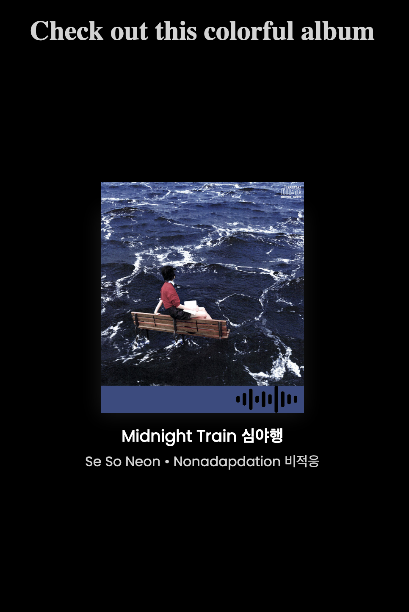

# Spotify Code Replicator

This program simulates the spotify song/album code that is shown when you share a song (pictured below).

## 🤔 Why did I make this

I'm really interested in how Spotify codes works and want to get better at js, so this is me combining the two.


## 🏎 Getting up and Running

1. Clone the project

2. Install the dependencies
```bash
$ npm install
```

### 🏃🏽‍♂️ How to run
You run the code by doing the following:
```bash
$ npm run build
# then
$ npm run serve
```
Once you get the server up and running you can find the project located at: http://localhost:8080/.

You should see this:




### Congrats! 🥳 You have officially gotten the project running and see Spotify code.

## 💯 Project facts
* This was Developed by Alexander Mitchell.
* I explain what I learned from this project and my thought process in this Medium post (coming soon).


